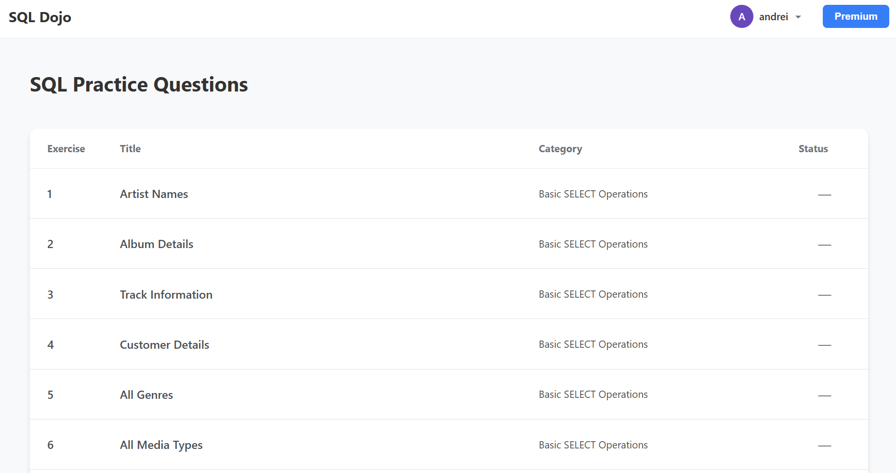
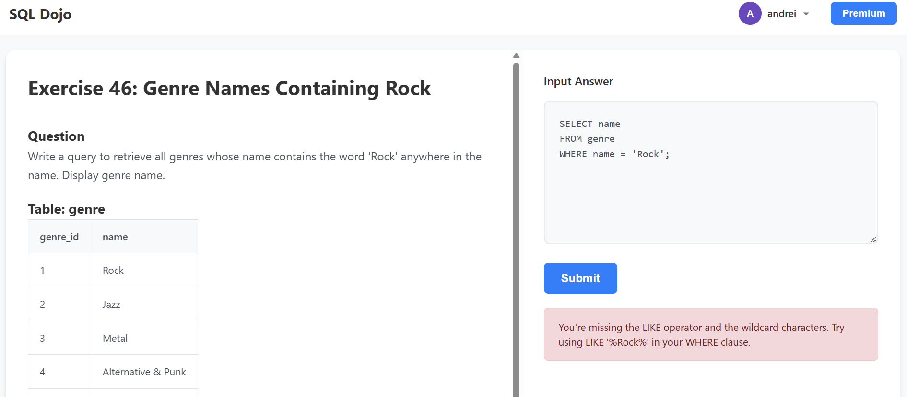

# SQL DOJO 🥋

**Master SQL through practice with AI-powered feedback**

SQL DOJO is an interactive web application for learning and practicing SQL queries. Work through exercises using the [Chinook database](https://github.com/lerocha/chinook-database) schema and get instant, intelligent feedback powered by Google's Gemini AI.





## Features

- 🎯 **Curated SQL Exercises** - Practice queries across multiple difficulty levels
- 🤖 **AI-Powered Validation** - Get intelligent feedback on your SQL queries using Google Gemini
- 📊 **Real Database Schema** - Work with the industry-standard Chinook database
- 💡 **Instant Feedback** - Learn from detailed hints and corrections
- 🚀 **Easy Setup** - Just add your API key and start practicing

## Prerequisites

- Python 3.13 or higher
- [uv](https://docs.astral.sh/uv/) package manager (recommended) or pip
- Google Gemini API key ([Get one free here](https://makersuite.google.com/app/apikey))

## Quick Start

### 1. Clone the repository

```bash
git clone https://github.com/forwardshapes/sql-dojo.git
cd sql-dojo
```

### 2. Set up environment variables

Copy the example environment file and add your Gemini API key:

```bash
cp .env.example .env
```

Edit `.env` and add your API key:
```
GEMINI_API_KEY=your_gemini_api_key_here
FLASK_ENV=development
```

### 3. Install dependencies

Using uv (recommended):
```bash
uv sync
```

### 4. Run the application

```bash
uv run app.py
```

The application will start on `http://localhost:5000`

## Project Structure

```
sql-dojo/
├── app.py                 # Main Flask application
├── modules/               # Core application logic
│   ├── exercises.py       # Exercise definitions and data
│   ├── ai_validation.py   # Gemini AI integration
│   ├── security.py        # Input validation and sanitization
│   └── rate_limiting.py   # API rate limiting
├── templates/             # HTML templates
│   ├── exercises.html     # Exercise list page
│   ├── exercise.html      # Individual exercise page
│   └── header.html        # Shared header component
├── static/                # CSS and static assets
│   └── styles.css
├── data/                  # Database schema files
│   └── Chinook_PostgreSql.sql
└── docs/                  # Documentation
    └── screenshots/       # Application screenshots
```

## How It Works

1. **Choose an Exercise** - Browse the exercise list and select a SQL challenge
2. **View Sample Data** - See sample rows from the relevant database tables
3. **Write Your Query** - Compose your SQL query in the editor
4. **Get AI Feedback** - Submit and receive instant validation from Gemini AI
5. **Iterate and Learn** - Use the feedback to improve your query

## Database Schema

SQL DOJO uses the [Chinook database](https://github.com/lerocha/chinook-database), a sample database representing a digital media store. It includes tables for:

- Artists, Albums, Tracks
- Customers, Employees, Invoices
- Genres, Media Types, Playlists

Each exercise displays sample data from the relevant tables to help you understand the structure.

## Configuration

### Environment Variables

- `GEMINI_API_KEY` - **(Required)** Your Google Gemini API key
- `FLASK_ENV` - Set to `development` for debug mode, omit for production

### Rate Limiting

The application includes built-in rate limiting to prevent API quota exhaustion:
- 1000 requests per day
- 200 requests per hour

## Development

### Running in Development Mode

```bash
FLASK_ENV=development uv run app.py
```

Development mode enables:
- Auto-reload on code changes
- Detailed error pages
- Debug logging

### Adding New Exercises

Edit `modules/exercises.py` and add your exercise to the `EXERCISES` dictionary following the existing pattern:

```python
{
    "id": 999,
    "title": "Your Exercise Title",
    "category": "Beginner|Intermediate|Advanced",
    "question": "Your question here...",
    "tables": ["table1", "table2"],  # Reference to CHINOOK_TABLES
    "validation_prompt": "Validation requirements..."
}
```

## Docker Support

Build and run with Docker:

```bash
docker build -t sql-dojo .
docker run -p 5000:5000 --env-file .env sql-dojo
```

## License

This project is open source and available under the [MIT License](LICENSE).

## Acknowledgments

- Database: [Chinook Database](https://github.com/lerocha/chinook-database) by Luis Rocha
- AI Validation: [Google Gemini](https://ai.google.dev/)
- Framework: [Flask](https://flask.palletsprojects.com/)

## Support

If you encounter any issues or have questions, please open an issue on GitHub.

---

**Happy querying! 🎉**
